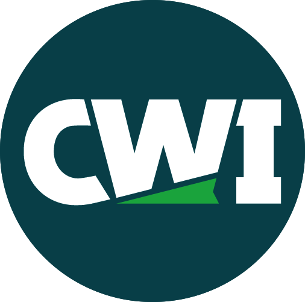

<!--
**aaronjpotter93/aaronjpotter93** is a ✨ _special_ ✨ repository because its `README.md` (this file) appears on your GitHub profile.

Here are some ideas to get you started:

- 🔭 I’m currently working on ...
- 🌱 I’m currently learning ...
- 👯 I’m looking to collaborate on ...
- 🤔 I’m looking for help with ...
- 💬 Ask me about ...
- 📫 How to reach me: ...
- 😄 Pronouns: ...
- ⚡ Fun fact: ...
-->

# Hello, I'm Aaron 👋

I'm a student of Computer Science currently enrolled at the Western Governers Univeristy working towards my Bachelors Degree. Welcome to my GitHub!

## 🔥 Current Project

| Project | Preview Link  | Code Directory |
|---------|-------------|--------------|---------|
| Spring Boot Webapp | [Live Preview](http://18.237.197.184:8081/mainscreen)| [Project Code](https://github.com/aaronjpotter93/d287-java-frameworks) |

---

## 📚 Education
### Legend
| Emoji | Meaning | 
|:---------:|:-------------:|
| ✔ | Completed |
| 🔄 | In Progress |
| ⬛ | Planned |

<h3>Western Governors University 🔄</h3>

<h4>Bachelors in Computer Science 🔄</h4>  

| Spring 2024 | Course Name | 
|:--------------------------:|:-------------------:|
| ✔ | D286 Data Management Applications | 
| ✔ | D197 Version Control | 
| ✔ | D281 Linux Foundations | 
| ✔ | D440 Fundamentals of Information Security |
| ✔ | C952 Computer Architecture |

| Fall 2024 | Course Name | 
|:---------:|:-------------------:|
|     ✔     | D286 Java Fundamentals | 
|     ✔     | D287 Java Frameworkds | 
|    ✔     | D288 Back-End Programming | 
|    🔄     | D387 Advanced Java |
|     ⬛     | C958 Calculus I |

| Spring 2025 | Course Name | 
|:--------------------------:|:-------------------:|
| ⬛ | Introduction to Computer Science |
| ⬛ | Introduction to Systems Thinking and Applications |
| ⬛ | Discrete Mathematics I |
| ⬛ | Discrete Mathematics II |
| ⬛ | Data Structures & Algorithms I |
| ⬛ | Data Structures & Algorithms II |

| Fall 2025 | Course Name | 
|:--------------------------:|:-------------------:|
| ⬛ | Introduction to AI for Computer Scientists |
| ⬛ | Software Design and Quality Assurance |
| ⬛ | Operating Systems for Computer Scientists |
| ⬛ | Advanced AI and ML |
| ⬛ | Software Engineering |
| ⬛ | Computer Science Project Development with a Team |

---

<h3>College of Western Idaho ✔</h3>

<h4>Associate of Applied Science in Software Development ✔</h4>

| Technologies| Languages Covered | Experience |
|:--------------------------:|:-------------------:|:------------:|
|  | C# | Beginner (2-3 projects) |
|  | HTML & CSS | Beginner (2-3 projects) |
| | JavaScript | Beginner (2-3 projects) |
| | SQL | Beginner (2-3 projects) |
|  | PHP | Beginner (2-3 projects) |
|  | React Native | Beginner (2-3 projects) |
|  | Unity | Beginner (2 projects) |

<h4>Swift Programming Academic Certificate</h4>

|  | Course Name | Experience |
|:--------------------------:|:-------------------:|:------------:|
| 2023 Summer ✔ | Programming Fundamentals | Beginner (2-3 projects) |
| 2023 Fall ✔ | Swift App Development I | Beginner (2-3 projects) |

### Frameworks

Front-End frameworks:

-  Vue.js
-  Create React App
-  Angular
-  WordPress

Back-End frameworks:

-  Spring Boot
-  Node

<!-- ---
<h3> | HarvardX 🔄</h3>
 

| Technologies | Course Name | Experience |
|:--------------------------:|:-------------------:|------------:|
|   | CS50x Intro to Computer Science 🔄 | Beginner |
|   | CS50P Intro to Computer Science ⬛ | Intermediate |
|   | CS50's Intro to Artificial Intelligence with Python ⬛ | Advanced | -->

<!-- ---
<h3> | Udemy Courses 🔄</h3>

| Technologies | Course Name | Experience |
|:--------------------------:|:-------------------:|------------:|
|   | The Complete SQL Bootcamp 🔄 | Beginner |
|   | Master the Linux Command Line 🔄 | Beginner |
|   | AWS Certified Developer Associate ⬛ | Beginner | -->

## 📚 Portfolio

Check out my portfolio website to explore more of my projects and experiences: [Portfolio Link](https://aaronpotter6.wordpress.com/)

## 📫 Connect with Me

Let's connect and collaborate:

- LinkedIn: <a href="https://www.linkedin.com/in/aaron-potter-31b172107/" target="_blank">My Profile</a>

- Email: aaronjpotter93@gmail.com

Feel free to reach out!

---

**Note:** This README is a living document and will be updated with new projects and experiences. Stay tuned! 🌟

  
